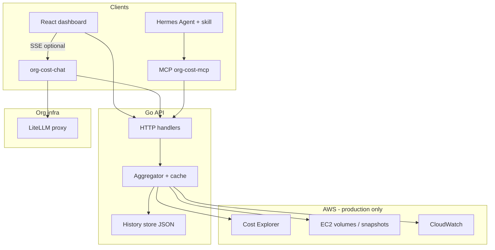

# Architecture

org-cost-api is a read-only AWS organization cost dashboard with four faces: a **Go HTTP API**, a **React web UI**, an optional **LiteLLM chat agent** for conversational Ask, and an **MCP server** for AI agents (Hermes, Cursor, etc.).

## Components

| Piece | Path | Role |
|-------|------|------|
| API server | `backend/cmd/server` | HTTP `/api/*`, auth, CORS, optional static UI |
| Aggregator | `backend/internal/service` | Dashboard cache, singleflight, per-account fan-out |
| History | `backend/internal/history` | Daily JSON snapshots for free prior-period trends |
| Frontend | `frontend/` | Vite + React dashboard and Ask tab |
| Chat agent | `mcp-server/org_cost_mcp/chat_app.py` | Optional multi-turn Ask via LiteLLM + tools |
| MCP | `mcp-server/` | stdio MCP tools wrapping the HTTP API |
| Skill | `skills/org-cost-api/` | Hermes agent guidance |

## Demo vs production mode

| | Demo (`ORG_COST_DEMO=1`) | Production |
|--|--------------------------|------------|
| AWS | None — in-memory fixtures | CE + EC2 + CloudWatch per config |
| Auth | Disabled | Optional `api_token_env` |
| Data | Synthetic multi-account spend | Live org data |
| History | Seeded fixture snapshot | Grows via daily dashboard runs |

Demo fixtures live in `backend/internal/demo/`. Production config uses `config.yaml` (gitignored) from `config.example.yaml`.

**Config discovery:** the Go server, `org-cost-chat`, and `org-cost-mcp` search for `config.yaml` automatically (cwd → parents → `~/.org-cost/config.yaml`). Override with `CONFIG_PATH`, `ORG_COST_CONFIG`, or `-config`. Optional `chat:` block in YAML configures the chat agent when env vars are unset.

## Request flow (dashboard)

1. Client calls `GET /api/report` (or `/api/dashboard`).
2. Handler checks cache; on miss, aggregator builds dashboard (parallel per account).
3. Trends compare current period to history snapshot or one CE payer call.
4. Response includes dashboard, trends, suggestions, and `ce_calls_used`.

## MCP flow

1. Hermes or Cursor spawns `org-cost-mcp` (stdio).
2. Tool calls hit the Go API over HTTP (`ORG_COST_API_URL`).
3. No AWS credentials in the LLM process — only the API holds org access.

See [mcp-setup.md](./mcp-setup.md) for Hermes and Cursor configuration.

## Conversational Ask (optional)

When `VITE_CHAT_URL` points at `org-cost-chat`:

1. Browser sends messages to `POST /v1/chat` (SSE).
2. Chat agent calls LiteLLM with tool definitions mirroring MCP tools.
3. Tool handlers call the Go API via the same HTTP client as MCP.
4. Without `VITE_CHAT_URL`, Ask uses rule-based `POST /api/ask` only.

See [chat-setup.md](./chat-setup.md).

See [getting-started.md](./getting-started.md) for setup and [KNOWN-ISSUES.md](./KNOWN-ISSUES.md) for limitations.
